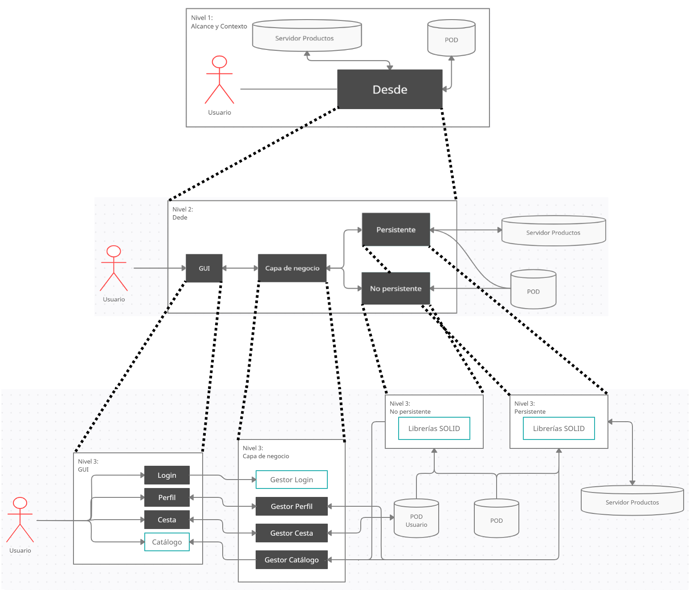
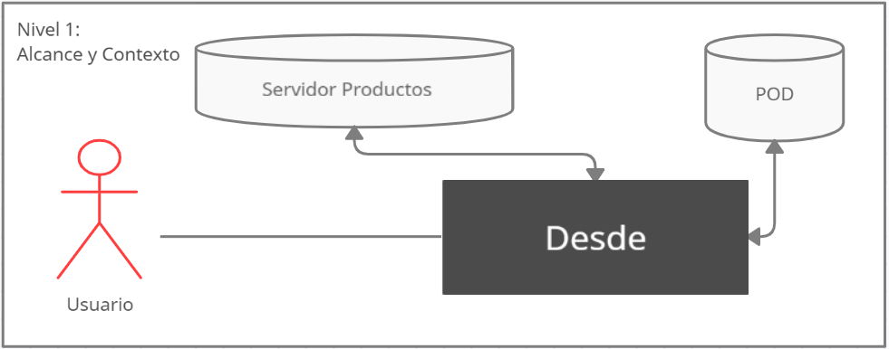
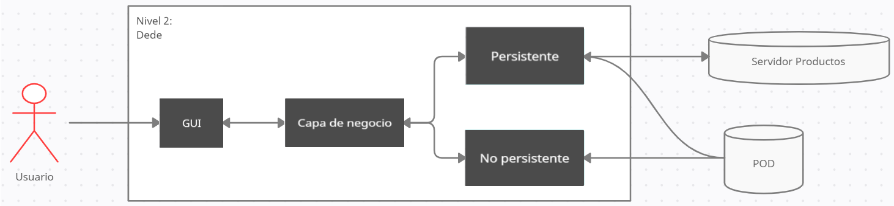
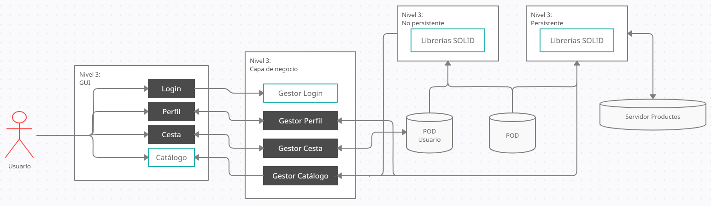

[[section-building-block-view]]

== Vista de bloque de creación

[role="arc42help"]
****
.Contenido
La vista de bloques de construcción muestra la descomposición estática del sistema en bloques de construcción (módulos, componentes, subsistemas, clases,
interfaces, paquetes, bibliotecas, marcos, capas, particiones, niveles, funciones, macros, operaciones,
estructuras de datos, ...) así como sus dependencias (relaciones, asociaciones, ...)

Esta vista es obligatoria para toda documentación de arquitectura.
En analogía con una casa, este es el _plano_.

.Motivación
Mantenga una visión general de su código fuente haciendo que su estructura sea comprensible a través de
abstracción.

Esto le permite comunicarse con su parte interesada en un nivel abstracto sin revelar detalles de implementación.

.Formulario
La vista de bloque de creación es una colección jerárquica de cuadros negros y cuadros blancos.
(ver figura abajo) y sus descripciones.

image:images/05_building_blocks-EN.png["Jerarquía de bloques de construcción"]

*Nivel 1* es la descripción del cuadro blanco del sistema general junto con el cuadro negro
descripciones de cuadro de todos los bloques de construcción contenidos.

*Nivel 2* hace zoom en algunos bloques de construcción del nivel 1.
Por lo tanto, contiene la descripción del cuadro blanco de los bloques de construcción seleccionados del nivel 1, junto con las descripciones del cuadro negro de sus bloques de construcción internos.

*Nivel 3* amplía los bloques de construcción seleccionados del nivel 2, y así sucesivamente.
****

=== Sistema general de caja blanca 

[role="arc42help"]
****
Aquí describe la descomposición del sistema general utilizando la siguiente plantilla de caja blanca. Contiene

 * un diagrama general
 * una motivación para la descomposición
 * descripciones de caja negra de los bloques de construcción contenidos. Para estos te ofrecemos alternativas:

   ** use la tabla _one_ para obtener una descripción general breve y pragmática de todos los componentes básicos contenidos y sus interfaces
   ** use una lista de descripciones de caja negra de los bloques de construcción de acuerdo con la plantilla de caja negra (ver más abajo).
   Dependiendo de la herramienta que elija, esta lista podría ser subcapítulos (en archivos de texto), subpáginas (en un wiki) o elementos anidados (en una herramienta de modelado).

 * (opcional :) interfaces importantes, que no se explican en las plantillas de cuadro negro de un bloque de construcción, pero son muy importantes para comprender el cuadro blanco.
Dado que hay tantas formas de especificar interfaces, ¿por qué no proporcionar una plantilla específica para ellas?
 En el peor de los casos, debe especificar y describir la sintaxis, la semántica, los protocolos, el manejo de errores,
 restricciones, versiones, calidades, compatibilidades necesarias y muchas cosas más.
En el mejor de los casos te saldrás con la tuya con ejemplos o firmas sencillas.
****

=== Vista general

[role="arc42help"]
****

****

=== Nivel 1

[role="arc42help"]
****

Bloques contenidos::
* Dede: bloque que representa la aplicación.

****
Desarrollo de cajas negras del nivel 1:

[cols="1,2" options="header"]
|===
| **Nombre** | **Responsabilidad**
| _Dede_ | _Gestiona toda la aplicación_
|===

****

=== Nivel 2

==== Dede
****
Desarrollo de cajas negras del nivel 2:

[cols="1,2" options="header"]
|===
| **Nombre** | **Responsabilidad**
| _GUI_ | _Gestionan la comunicación visual con el usuario_
| _Capa negocio_ | _Trata los datos obtenidos de la GUI_
| _Persistente_ | _Trata los datos que han de mantenerse en el servidor_
| _No persistente_ | _Trata los datos que serán utilizados únicamente mientras la sesión esté iniciada_
|===

****

=== Nivel 3

==== GUI
****
Desarrollo de cajas negras del nivel 3:

[cols="1,2" options="header"]
|===
| **Nombre** | **Responsabilidad**
| _Login_ | _Muestra al usuario una pantalla para que ingrese sus credenciales_
| _Perfil_ | _Muestra al usuario una pantalla para que observe sus datos personales y poder editarlos_
| _Cesta_ | _Muestra al usuario una pantalla para que observe los productos que quiere comprar_
| _Catálogo_ | _Muestra al usuario una pantalla para que observe los productos que se pueden comprar de la tienda_
|===

****

==== Capa negocio
****
Desarrollo de cajas negras del nivel 3:

[cols="1,2" options="header"]
|===
| **Nombre** | **Responsabilidad**
| _Gestor Login_ | _Trata las credenciales introducidas por el usuario_
| _Gestor Perfil_ | _Trata los datos del usuario para poder ser editados o simplemente observados_
| _Gestor Cesta_ | _Trata los productos que quiere comprar un usuario durante sesión_
| _Gestor Catálogo_ | _Trata los productos que están disponibles para ser comprados_
|===

****

==== Persistente
****
Contiene librerías SOLID.
****

==== No persistente
****
Contiene librerías SOLID.

****